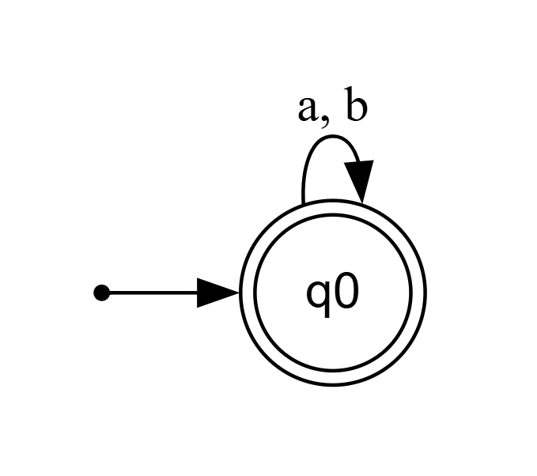
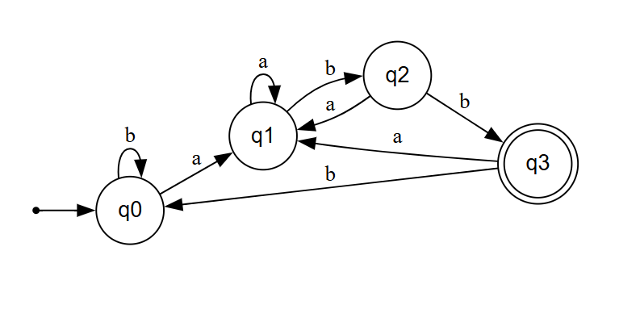

# Simulador de Autómata Finito Determinista (AFD)

## Introducción

Este proyecto consiste en la implementación en Python de un **Autómata Finito Determinista (AFD)** diseñado para procesar y evaluar cadenas de texto. La solución toma como referencia los ejercicios del **Ejemplo 3.16 (Página 149)** del libro *Compiladores: Principios, Técnicas y Herramientas* (Aho, Sethi, Ullman).

A partir de las cuatro expresiones regulares propuestas en el texto guía, se dedujeron las tablas de transiciones de estado correspondientes para configurar el autómata dinámicamente mediante archivos externos `.txt` y evaluar las cadenas de prueba requeridas.

---

## Expresiones Regulares Implementadas

| Literal | Expresión Regular | Archivo de Configuración | Descripción del Lenguaje |
| :---: | :--- | :--- | :--- |
| **a)** | `(a\|b)*` | `config/conf_a.txt` | Acepta cualquier secuencia de símbolos 'a' y 'b' (incluida la cadena vacía). |
| **b)** | `(a*\|b*)*` | `config/conf_b.txt` | Equivalente formal a `(a\|b)*`. |
| **c)** | `((ε\|a)b*)*` | `config/conf_c.txt` | Secuencias arbitrarias sobre el alfabeto `{a, b}`. |
| **d)** | `(a\|b)*abb` | `config/conf_d.txt` | Cadenas sobre `{a, b}` que finalizan estrictamente en `abb`. |

---

## Estructura del Repositorio

```text
taller_afd/
├── cadenas/                 # Archivo de cadenas de prueba de entrada
│   └── cadenas.txt
├── config/                  # Archivos de configuración con la matriz de transiciones
│   ├── conf_a.txt
│   ├── conf_b.txt
│   ├── conf_c.txt
│   └── conf_d.txt
├── docs/                    # Capturas de los diagramas de estados (.png)
│   └── diagrams/
│       ├── diagrama_a_b_c.png
│       └── diagrama_d.png
├── scripts/                 # Código fuente ejecutable del AFD
│   └── AFD.py
└── README.md

```
---
## Diagramas de Estados

### Diagrama AFD (Literales A, B y C)
*Las tres primeras expresiones comparten la misma representación determinista.*



---

### Diagrama AFD (Literal D)
*Representación del autómata determinista para la expresión que exige la terminación `abb`.*



---

## Instrucciones de Ejecución

Para ejecutar el programa en Linux, navega a la raíz del repositorio y pasa como parámetros el archivo de configuración y el de cadenas:

```bash
# Probar el literal a
python3 scripts/AFD.py config/conf_a.txt cadenas/cadenas.txt

# Probar el literal d
python3 scripts/AFD.py config/conf_d.txt cadenas/cadenas.txt
```
